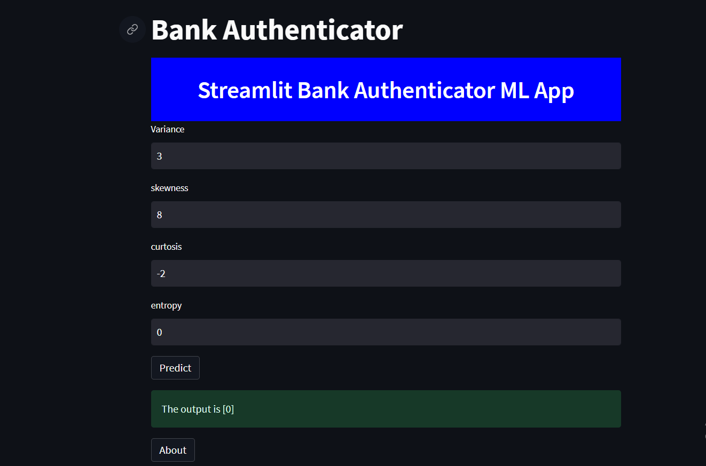

Sample ML web App using Streamlit


How to run the web app

create virtual env 
```
conda create -n streamlit_demo python=3.7 -y

```
activate
```
conda activate streamlit_demo

```
install requirements file

```
pip install requirements.txt

```
run the app

```
streamlit run app.py

```

deployed link (via Streamlit cloud)

```
https://sarikamohan08-bank-note-authentication-using-streaml-app-ijyotu.streamlit.app/

```

output


